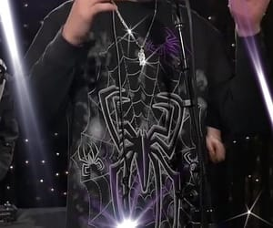

# 🌐 GdeTyphoon — Bio Link Page

> Персональная страница-визитка с тёмным киберпанк-дизайном.  
> Сделана как замена Linktree / Taplink — хостится прямо через GitHub Pages.

---

## 📁 Структура проекта

```
/
├── index.html       # Главная страница
├── style.css        # Стили (если вынесены отдельно)
└── photo/
    ├── avatar.jpg   # Аватар профиля
    └── banner.mp4   # Видео-баннер в шапке
```

---

## 🚀 Деплой на GitHub Pages

1. Создай репозиторий на GitHub (например, `gdetyphoon.github.io`)
2. Загрузи все файлы в ветку `main`
3. Перейди в **Settings → Pages**
4. Выбери источник: `Deploy from a branch → main → / (root)`
5. Готово — страница будет доступна по адресу:

```
https://gdetyphoon.github.io
```

---

## ✏️ Как кастомизировать

### Сменить аватар
Замени файл `photo/avatar.jpg` на своё фото.  
Или измени ссылку в `index.html`:
```html

```

### Сменить баннер
Замени `photo/banner.mp4` на своё видео.

### Сменить ник
```html
<span class="nick">GdeTyphoon</span>
```

### Сменить ссылку Telegram
```html
<a href="https://t.me/flytag" ... class="tg-btn">
```

### Изменить цвета (CSS-переменные)
В начале `<style>` в `index.html`:
```css
:root {
  --neon-cyan:   #00f5ff;   /* основной акцент */
  --neon-purple: #bf00ff;   /* вторичный акцент */
  --neon-red:    #ff2244;   /* цвет NOTICE / предупреждений */
  --neon-gold:   #ffd700;   /* выделения (highlight) */
}
```

---

## 🛠️ Технологии

| Технология | Описание |
|------------|----------|
| HTML5 | Разметка страницы |
| CSS3 | Анимации, glassmorphism, neon glow |
| Google Fonts | Orbitron + Exo 2 |
| GitHub Pages | Бесплатный хостинг |

---

## ⚠️ Важно

На странице размещено официальное заявление:

> **GdeTyphoon НЕ продаёт** Telegram NFT, GIFT, USERNAME за USDT, TON, UAH, RUB, STARS или любые другие активы.

Любые предложения от имени аккаунта — **мошенничество**. Официальный контакт: [@flytag](https://t.me/flytag)

---

## 📄 License

Personal use only. All rights reserved © GdeTyphoon
